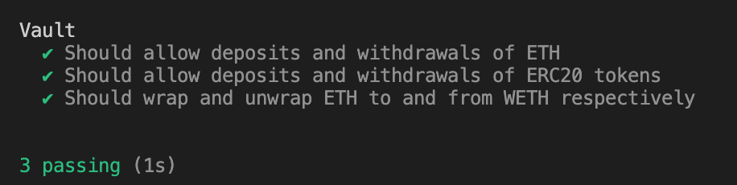

# Vault Smart Contract

## Objective

The objective of this project is to implement a Vault smart contract on the Ethereum blockchain. The Vault allows users to securely deposit and withdraw ETH and ERC20 tokens, and provides functionality for wrapping and unwrapping ETH into WETH (Wrapped Ether) without needing to withdraw ETH first.

## Contract Description

### Vault.sol

The `Vault` contract allows users to deposit and withdraw both ETH and ERC20 tokens. It also provides the functionality to wrap and unwrap ETH into WETH within the vault.

#### Features

1. **Deposit and Withdraw ETH:**

   - Users can deposit ETH into the vault.
   - Users can withdraw their deposited ETH from the vault, but cannot withdraw more than they have deposited.

2. **Deposit and Withdraw ERC20 Tokens:**

   - Users can deposit any ERC20 tokens into the vault.
   - Users can withdraw their deposited ERC20 tokens from the vault, but cannot withdraw more than they have deposited of a given token.

3. **Wrap and Unwrap ETH:**
   - Users can wrap their deposited ETH into WETH without withdrawing.
   - Users can unwrap their WETH back into ETH within the vault.

### Deployment and Verification Scripts

```
- Deployment script is added to easily deploy the contract to the desired Network(currently using Arbitrum sepolia).
- Verification script is also added for auto verification of the source code on the deployed network.
- Requires to pass  Arbitrum sepolia alchemy API and private key for deployment while Blockchain explorer API for verification to be placed in .env file, see .env.example for reference.
```

## Compiling and Running Tests

### Prerequisites

- Node.js
- Yarn
- Hardhat

### Installation

1. Clone the repository:

   ```bash
   git clone https://github.com/Akkii4/VaultContract_Assignment.git
   cd VaultContract_Assignment
   ```

2. Install dependencies:
   ```bash
    yarn install
   ```

### Unit Test covering major functionality of the contract



Try running some of the following tasks:

```shell
npx hardhat compile
npx hardhat test
npx hardhat run scripts/deploy.js --network arbitrum
```
